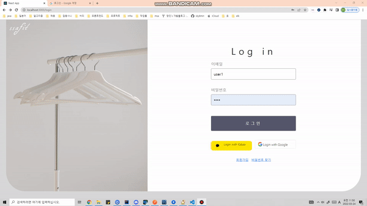
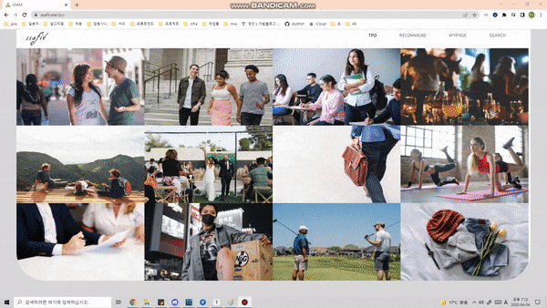
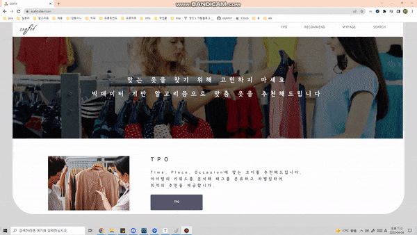
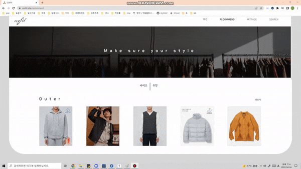
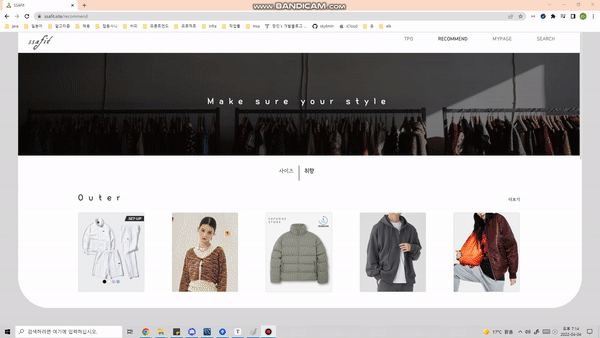
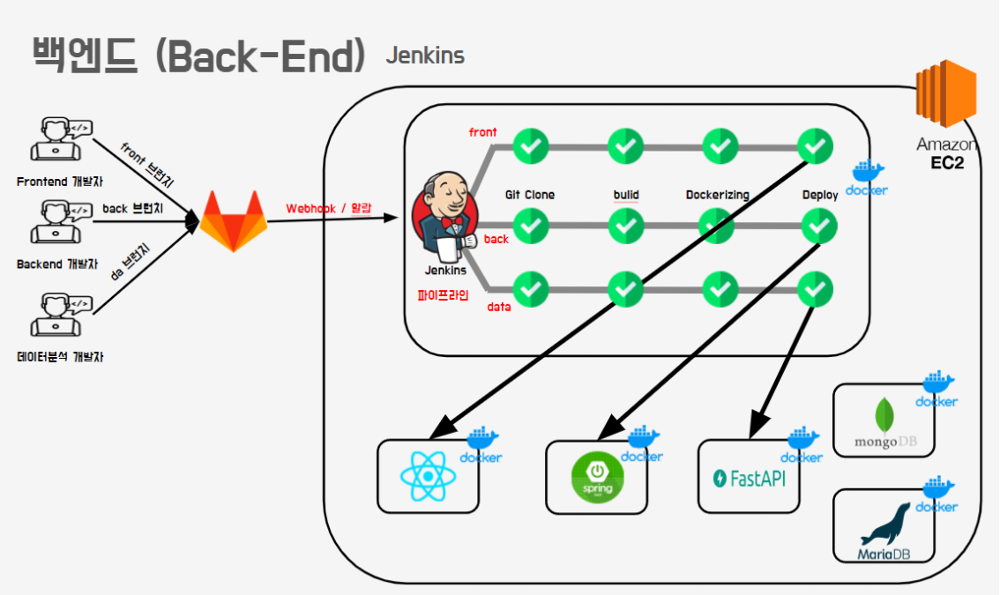

# 👔 여러분의 옷장을 책임질 ... *SSAFit* ( BigData Project)

#### 빅데이터 기반  개인 맞춤 옷, 코디 추천 플랫폼


## 👪 팀원 소개

##### 정재호 ( Jae Ho Jung )

- **빅데이터 추천, 웹 크롤링 , FastAPI 서버 개발** 
- 🍒 Github : https://github.com/jaho901

##### 정윤정 ( Yoon Jeong Jeong )

- **빅데이터 추천, 웹 크롤링 , FastAPI 서버 개발** 
- 🍓 Github : https://github.com/yoonjung1205

##### 이혜진 ( Hye Jin Lee )

- **프론트 엔드 React 개발** 
- 🍇 Github : https://github.com/hy2jin

##### 임경훈 ( Kyung Hun Lim )

- **프론트 엔드 React 개발** 
- 🍈 Github : https://github.com/KyounghoonLim

##### 김영기 ( Yeong Ki Kim )

- **서비스 아키텍쳐 설계 및 구현, 백엔드 개발** 
- 🍐 Github : https://github.com/yeongki0944

##### 김창민 ( Chang Min Kim )

- **서비스 아키텍쳐 설계 및 구현, 백엔드 개발** 
- 🍅 Github : https://github.com/sky6min


## 📆 프로젝트 개요

####        


- ##### 진행 기간 : 2022.02.21 ~ 2022.04.08

- ##### 목표 

  - ##### 유저 리뷰 기반의 개인 맞춤 옷, 코디 추천 서비스를 개발합니다.

  - ##### TPO에 맞는 코디를 추천하는 서비스를 사용자에게 제공합니다.

  - ##### 개인의 취향에 맞는 옷을 추천하는 기능을 지원합니다.

- ##### ✏️기획서

  - ##### [기능명세서](https://docs.google.com/spreadsheets/d/1DajUUoxczjtIi0OPYsWq2eqnvQW8JyVJK21xZevCUzE/edit#gid=0)

  - ##### [ERD](https://www.erdcloud.com/d/ZFTtEdaEgRPWyuiR9)

- ##### 🖼 와이어프레임

  - ##### [와이어프레임 확인](https://www.figma.com/file/NCA8xGy6dUQ0tsMohEuxhF/%ED%8A%B9%ED%99%94PJT?node-id=0%3A1)

- #### ▶ **[팀 노션](https://www.notion.so/c1f73b2a71e44dc9a17adcdf82fd8968)**

- #### **▶ [마인드맵](https://www.mindmeister.com/map/2198880827?t=BbTDvqBLhA)**


## 📣 프로젝트 소개

##### 코로나 19 바이러스로 인한 언컨택트 시대를 맞이하여 많은 소비자들이 온라인 쇼핑몰을 이용하여 옷을 구매하고 있습니다.

##### 하지만, 옷의 사이즈가 맞지않거나 취향에 맞지 않아 반품을 하거나 중고거래를 이용하여 불필요한 소비가 빈번하게 발생하고 있습니다. 이러한 구매 패턴이 반복되어 소비자들은 온라인 의류 쇼핑에 대해 큰 불안감을 느끼고 있습니다.

##### 소비자들의 의류 쇼핑에 대한 불안감을 극복할 수 있도록 저희는 빅데이터 및 머신러닝 기반의 개인 맞춤 의류 추천 웹 플랫폼 SSAFit을 개발하였습니다.

##### SSAFit을 이용하는 사용자들은 

##### 1. 개인의 키, 몸무게, 나이, 성별등의 개인정보로 개인 맞춤 의류를

##### 2. 개인의 성향, 좋아요 여부 등의 개인정보로 취향 맞춤 의류를

##### 3. 각각의 상황을 선택하여 상황 맞춤 코디를 추천받을 수 있습니다.

##### 또한, 옷 상세 정보를 조회 기능과 검색 기능을 통해 사용자들이 옷을 구매하는데 많은 도움을 제공하고 있습니다. 


## ✔️ 적용한 빅데이터 기술 사항. 

## LightFM

기본적인 행렬 분해(Matrix Factorization) 기법들은 Collaborative Interaction 데이터가 희소할 때 User와 Item의 잠재 벡터를 효과적으로 추정하는 일이 굉장히 어렵기 때문에 cold-start 상황에서 좋은 성능을 보여주지 못한다.

**LightFM**은 Content-based와 Collaborative Filtering의 장점을 결합한 모델링 방법이다.

- 학습 데이터에서 Collaborative 데이터와 User/Item Feature를 모두 사용한다.
- LightFM에서 생성된 Embedding 벡터는 Feature에 대한 중요한 의미 정보를 포함하고 있고, 이는 tag 추천과 같은 일에서 중요하게 사용된다.

#### LightFM

> User Feature와 Item Feautre를 학습 과정에 포함하는 데에 적합한 구조로 만들어져 있다.
>
> User Feature : User에 대한 설명
>
> Item Feature : Item에 대한 설명


각 User와 각 Item에 대한 모델의 예측 값은, 이 User와 Item의 **Representation** (잠재 벡터)의 내적이다.


최적화 목적함수는 parameter들이 주어졌을 때의 데이터에 대한 우도를 최대화 하는 것으로 설정된다.


### ※ 참고

##### Cold Start

- 새로운 또는 어떤 유저들에 대한 충분한 정보가 수집된 상태가 아니라서 해당 유저들에게 적절한 제품을 추천해주지 못하는 문제

##### Content-based

- 메타데이터를 통해 Item이나 User를 표현한다.
- User는 독립적으로 추정되기 때문에 Transfer Learning이 불가능하다.
- 각 User에 대해 많은 양의 데이터를 필요로 할 때, 기존 행렬 분해보다 더 안좋은 성능을 보인다.

##### Collaborative Filtering

- 많은 사용자들로부터 얻은 기호정보에 따라 사용자들의 관심사들을 자동적으로 예측하게 해주는 방법
- 사용자들의 과거의 경향이 미래에서도 그대로 유지 될 것이라는 전제


#### 실행 과정

```bash
pip install lightfm
```

```python
from lightfm import LightFM

model = LightFM(no_components=30)
model.fit(train, epochs=20)
predictions = model.predict(test_user_ids, test_item_ids)
```


#### 참조

> https://making.lyst.com/lightfm/docs/home.html
>
> https://greeksharifa.github.io/machine_learning/2020/06/01/LightFM/


## 특이값 분해(SVD ,Singular Value Decomposition)

특이값 분해는 정방 행렬(Square Matrix)뿐만 아니라 행과 열의 크기가 다른 행렬에 대해서도 적용할 수 있습니다. 즉, 특이값 분해는 모든 직각 행렬에 대해 가능합니다.

m x n 크기의 행렬을 다음과 같이 분해하는 것을 의미합니다.


#### Truncated SVD

실제로는 ∑의 비대각 부분과 대각 원소 중 특이값이 0인 부분을 모두 제거하고, 제거된 ∑에 대응되는 U와 V 원소도 함께 제거해 차원을 줄인 형태로 SVD를 적용합니다.

Truncated SVD는 ∑의 대각 원소 중 상위 몇 개만 추출하고 여기에 대응하는 U와 V의 원소도 함께 제거해 차원을 줄인 것입니다. ∑의 대각 원소 중 상위 t개만 추출한다고 하면 아래와 같이 분해됩니다.


#### 실행 과정

```bash
pip install sklearn
```

```python
from sklearn.decomposition import TruncatedSVD
from sklearn.metrics.pairwise import cosine_similarity
```


#### 참조

https://scikit-learn.org/stable/modules/generated/sklearn.decomposition.TruncatedSVD.html


## ⚡ 주요 기능

#### 소셜 로그인을 통해 간편하게 서비스 이용 가능

> Google, Kakao 소셜 로그인을 이용하여, 간단한 신체정보 입력만으로 SSAFit을 이용할 수 있습니다.
>
> 회원정보는 JWT Refresh Token, Access Token으로 관리되고 있습니다.




#### TPO에 맞는 코디 추천 기능을 제공

> 일상적으로 발생할 수 있는 대표적인 12가지의 상황 별 맞춤 코디 추천.


- ##### TPO 코디 상세 페이지

  > 좋아요, 싫어요 정보를 저장하여 빅데이터 학습에 적용하여 최적의 맞춤 서비스로 개선해나가고 있습니다.




#### 개인 사이즈 · 취향 맞춤 추천 서비스

> 개인 사이즈 · 취향에 맞는 옷을 추천합니다.




- 개인 별 좋아하는 색깔, 스타일, 카테고리 별로 옷을 추천하는 기능을 제공합니다.

  

  

- **옷 디테일 페이지**

  - 디테일 페이지에서 해당 옷이 언제 가장 많이 구매되었고, 유저들의 리뷰를 확인할 수 있습니다.
  - 또한, 워드클라우드를 통해 해당 옷의 부가적인 정보(장점, 특징)를 제공합니다.

  


#### 검색 기능

> 검색 기능을 통해 원하는 옷을 검색할 수 있습니다.


## ❔ 서비스 아키텍쳐




## ⚙ 설치 및 실행 방법

#### 서비스 아키텍쳐 구조 및 실행 방법

- [인프라 세팅](https://sulky-twig-f46.notion.site/8babd4ecfd4b4671858961605c83125a)
- [Jenkins 세팅](https://sulky-twig-f46.notion.site/Jenkins-c9f033b4bf6e4fc690c2aaf8cb674df6)
- [Nginx 세팅](https://sulky-twig-f46.notion.site/nginx-3999e0f28ae24195a68e20c00dc05e5f)


#### FrontEnd(React)

```bash
npm install --global yarn
cd frontend
npm i
yarn start(or npm start)
```


#### BackEnd(Spring)

```shell
cd backend/backend-java
./gradlew build -Pprofile=prod
◦sudo java -jar -Dspring.profiles.active=prod [생성된 JAR 파일명].jar
```


#### BackEnd(FastAPI-DA)

```bash
pip install fastapi
pip install uvicorn

uvicorn main:app --reload
```


## 🐤 최종산출물

##### 최종 발표 자료

- PPT
  - [최종 발표 PPT](https://docs.google.com/presentation/d/1vaThCDV7jUc5sO8EXBCUkJlnMyKyAfBfJDADosxIj0c/edit#slide=id.p27)

    
  
- 홈페이지
  
  - https://ssafit.site/


