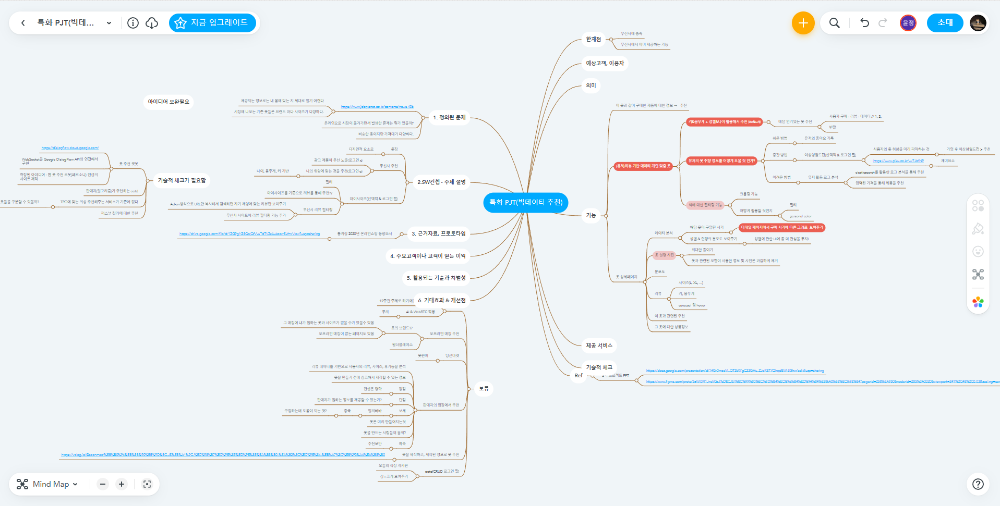

# SSAFY Bigdata project

## ✔ 프로젝트 기획 및 설계
▶ https://docs.google.com/spreadsheets/d/1DajUUoxczjtIi0OPYsWq2eqnvQW8JyVJK21xZevCUzE/edit#gid=0

#### 주제 : 옷 (의류) 추천

- 키&몸무게 + 성별&나이 활용해서 추천 (default)
- elasticsearch를 활용한 로그 분석을 통해 추천
- 색을 저장할 수 있으면 색과 관련된 의류도 추천
- 계절 및 기온 별 옷 스타일 추천
- 이 옷과 같이 구매한 제품에 대한 정보 → 추천
  - 부족하면 채워 넣는다. (랜덤 or 알고리즘)


#### 페이지

1. 시작 페이지
   1. 소개
2. 로그인 & 회원가입
3. 옷 리스트 보여주는 페이지
   1. 카테고리별로 의류 (대분류 / 소분류 / 색상 / 가격 / 계절)
   2. User에 맞게 추천한 의류 ⇒ 키&몸무게&성별&나이를 통한 추천(로그인한 유저들만) (User + Item) ⇒ LightFM(장점 mf 씹어먹는다) ⇒ 결과
   3. 모든 옷중에서 가장 조회수가 높은 옷, best상품(로그인 안한 유저들만)
4. 옷 디테일 페이지 (knn, MF, MF+PLSI)
   1. 각각의 옷 설명 ⇒ 구매버튼(무신사 링크)
   2. 색이 유사한 옷 추천(로그인 여부 상관 무) ⇒ Item
   3. 이 옷과 같이 주로 사는 다른 의류 추천(로그인 여부 상관 무) ⇒ Item
   4. ElasticSearch 활용한 옷 추천(로그인 필요) ⇒ 로그인이 안되있다.(생략) (우선순위 ↓)
5. 프로필 페이지
   1. 내 정보 수정
   2. 찜한 목록
   3. 마이사이즈
   4. 1:1 문의
   5. 상품문의


## ✔ 팀 노션

▶  https://www.notion.so/c1f73b2a71e44dc9a17adcdf82fd8968


## ✔ 마인드맵



▶  https://www.mindmeister.com/map/2198880827?t=BbTDvqBLhA


## How to Run

### Sub1

```sh
cd sub1
pip install -r requirements.txt
python parse.py
python analyze.py
python visualize.py
```

### Sub 2

**Backend**

```sh
cd sub2/backend
pip install -r requirements.txt
python manage.py makemigrations
python manage.py migrate
python manage.py initialize
python manage.py runserver
```

**Frontend**

```sh
cd sub2/frontend
npm install
npm run serve
```

### data file
  * 기본 제공 데이터: 맛집 데이터
    - 다운로드 링크: https://lab.ssafy.com/s06-common-files/bigdata-review-data/-/blob/master/data.zip
    - PW: ssafy2022!@#$
  * 추가 제공 데이터: 카드사 데이터
    - 다운로드 링크: https://lab.ssafy.com/s06-common-files/bigdata-card-data/-/blob/master/card-data.zip
    - PW: ssafy2022!@#$

** SSAFY에서 제공하는 기업 데이터는 프로젝트 외에 다른 목적으로 사용할 수 없으며, 데이터 원본 파일의 외부 반출을 금합니다.**

