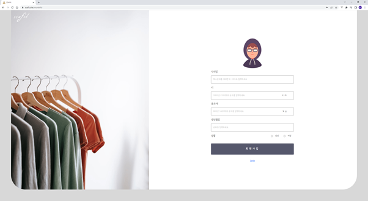
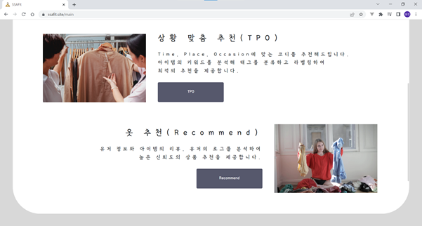
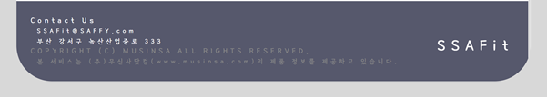
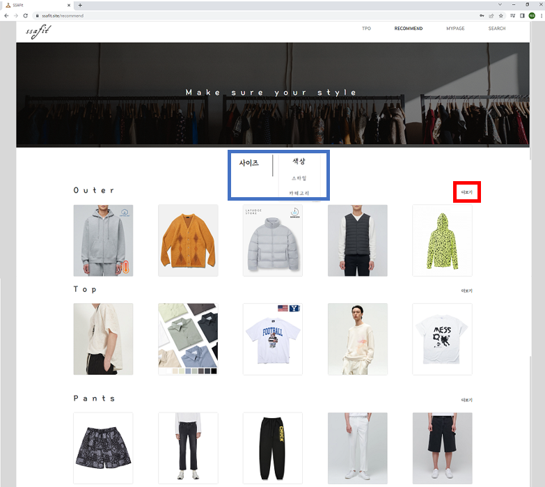
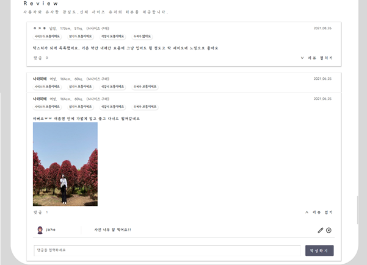
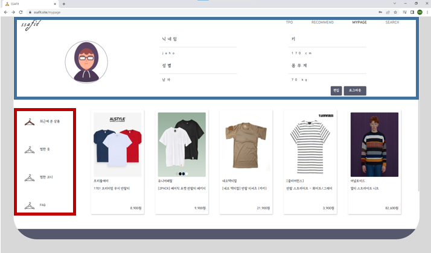
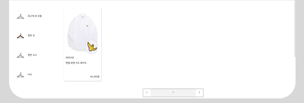
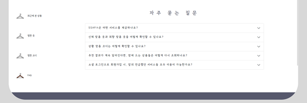
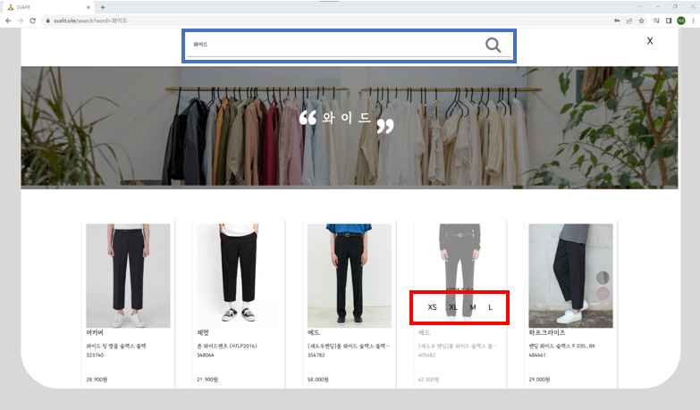

# 시연 시나리오

### 1. 시작 페이지

- Log in 버튼을 누르면 로그인 페이지로 이동할 수 있습니다.

- 사이트의 전체적인 서비스에 대한 설명입니다.

- GO 버튼을 클릭하면 마찬가지로 로그인 페이지로 이동합니다.

 

### 2. 로그인 페이지

- 일반계정, 또는 소셜로그인을 통해 사이트의 서비스를 이용할 수 있습니다.
- 아직 사이트에 가입하지 않았다면, 아래쪽에 회원가입 버튼을 클릭하여 회원가입 할 수 있습니다.
  (카카오나 구글의 소셜로그인을 이용하면 회원가입도 자동으로 됩니다.)

### 3. 회원가입 페이지

- 이메일을 양식에 맞게 입력하고 확인버튼을 눌러 중복확인을 합니다.

- 비밀번호를 8~16글자, 특수문자, 영어, 숫자를 포함하여 입력합니다. 

- 비밀번호 확인에서 위에서 입력한 비밀번호를 입력한 후 다음 버튼을 누릅니다.
  (위에서 양식에 어긋나면 회원가입이 되지 않습니다.)

- 닉네임, 키, 몸무게, 생년월일, 성별을 양식에 맞게 입력한 후 회원가입 버튼을 클릭하면 회원가입이 완료됩니다.

### 4. 메인 페이지

- 파란색 부분의 네비게이션 바에서 사이트의 주요기능을 확인할 수 있습니다. 각각의 버튼을 누르면 해당 서비스로 이동합니다.

- 상황 맞춤 추천(TPO) 서비스에 대한 설명과 옷 추천(Recommend) 서비스에 대한 설명입니다. 각각의 버튼을 누르면 해당 서비스가 제공되는 페이지로 이동합니다.

- 화면 가장 아래쪽에는 사이트의 Footer가 있습니다. 저희 사이트는 ㈜ 무신사닷컴의 제품정보를 바탕으로 서비스를 제공하고 있습니다.

### 5. TPO

- 총 12개의 상황이 나타나 있고, 사진에 마우스를 올려두면 위 사진의 붉은 부분처럼 해당 상황이 표시됩니다. 그 상황을 클릭하면, 그에 맞는 코디를 추천 받을 수 있습니다.

- ‘결혼식’이라는 상황에 맞는 코디를 추천 받습니다. 코디에 이용된 상품들의 정보가 오른편에 표시됩니다. 해당 상품이 ‘SSAFit’ 사이트에 저장된 상품이면 ‘SSAFit’내의 해당 상품의 디테일페이지로 이동합니다. 저장되지 않은 상품이면, ‘무신사’ 사이트의 해당 상품 페이지로 이동합니다.

- 해당 코디가 마음에 들면, ‘맘에 들어요’ 버튼을 클릭하고, 마음에 들지 않는다면 ‘별로에요’ 버튼을 클릭합니다. ‘맘에 들어요’ 를 누른 코디는 마이 페이지에서 확인할 수 있습니다.

### 6. RECOMMEND

- 파란색 부분을 통해 사이즈 추천과 취향 추천(색상, 스타일, 카테고리)을 통해 각각 원하는 정보를 얻을 수 있습니다.

- 빨간색 부분의 더보기 버튼을 통해서 각각의 옷 분류별로 30개의 추천 정보를 얻을 수 있습니다.

- 남자인 경우 Outer, Top, Pants의 분류로 각각 추천을 받을 수 있고,
  여자인 경우 Outer, Top, Pants, Onepiece, Skirt의 분류로 각각 추천을 받을 수 있습니다.

 

### 7. DETAIL 

- 각 옷의 이름, 브랜드, 평점, 카테고리, 가격, 사이즈 및 해시태그를 조회할 수 있습니다.

- 하트 버튼을 통해서 해당 옷을 좋아요 또는 좋아요 취소를 선택할 수 있습니다.

- 구매하러 가기 버튼을 통해서 각 옷의 구매 사이트로 이동할 수 있습니다.

- 상품정보, 추천상품, 사용후기 버튼을 통해 아래 존재하는 해당 부분으로 바로 이동할 수 있습니다.

 

- Real Fit 을 통해서 해당 옷을 직접 입은 다른 사람들의 사진을 조회할 수 있습니다.

- 각 사진을 통해 그 사람의 키와 몸무게, 성별에 대한 정보를 얻을 수 있습니다.

 

- Analysis를 통해서 해당 옷을 구매한 사람들이 선택한 가장 많은 단어들을 워드 클라우드를 통해 확인할 수 있습니다.

- 아래쪽 Gender에서 해당 옷을 구매한 성별의 비율을 조회할 수 있습니다.

- Month에 표시된 그래프를 통해 각각의 달에 구매했던 사람들의 비율을 조회할 수 있습니다.

 

- Recommendation에서 해당 옷과 유사한 상품에 대한 추천을 받을 수 있습니다.

- 그 아래쪽에는 해당 옷과 같은 브랜드의 인기 상품을 추천 받을 수 있습니다.

- 해당 옷을 구매한 사람들의 리뷰를 확인할 수 있습니다.

- 각 리뷰에 대해 댓글을 달 수 있고, 직접 작성한 댓글은 수정, 삭제가 가능합니다.

### 8. MYPAGE

- 파란색 부분을 통해 자신의 정보를 확인할 수 있습니다.

- 편집 버튼을 통해 자신의 정보를 수정할 수 있고, 로그아웃 버튼을 통해 로그아웃 할 수 있습니다.

- 빨간색 부분에서 최근에 본 상품, 찜한 옷, 찜한 코디와 FAQ를 각각 조회할 수 있습니다.

 

#### 8-1. 편집

- 프로필이미지와 닉네임, 키, 몸무게 그리고 성별을 수정할 수 있습니다.

- 비밀번호 변경 버튼을 통해 비밀번호 수정을 할 수 있습니다.

#### 8-2. 최근에 본 상품

- 최근에 본 상품을 조회할 수 있습니다.

 

#### 8-3. 찜한 옷

- 내가 ‘좋아요’ 버튼 누른 옷을 ‘찜한 옷’ 버튼을 통해서 조회할 수 있습니다.

 

#### 8-4. 찜한 코디

- 내가 ‘마음에 들어요’ 버튼을 누른 코디를 ‘찜한 코디’ 버튼을 통해서 조회할 수 있습니다.

 

#### 8-5. FAQ

- 자주 묻는 질문 즉, 사이트를 이용하면서 생길 수 있는 질문과 이에 대한 답변을 확인할 수 있습니다.

### 9. SEARCH

- 네비게이션 바에 존재하는 SEARCH 버튼을 누르거나 파란색 위치에 검색하고자하는 단어를 입력합니다.

- 단어를 통해 얻어진 의류를 선택하고, 빨간색에 존재하는 사이즈를 선택하면, 원하는 옷의 디테일 페이지로 이동할 수 있습니다.